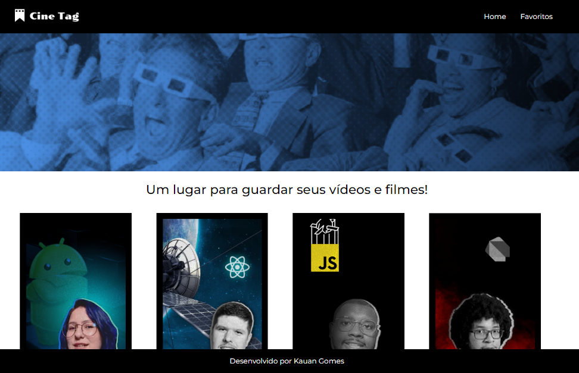

## 

####  Plataforma de vídeos da Cinetag, usando princípios do useContext e React Router DOM 

[Link do Projeto](https://cine-tag-mu-one.vercel.app/)

## 🛠Tools
* [React Router](https://reactrouter.com/en/main)
* [React](https://react.dev/)
* [JSON Server](https://my-json-server.typicode.com/)
* HTML5
* CSS3

## Para iniciar Projeto na sua maquina

`Para clonar repositório:`
```
git clone https://github.com/Kauan-Gomes/CineTag.git
```
`Instalar as dependencias:`
```
npm install
```
`Iniciar servidor:`
```
npm start
```


